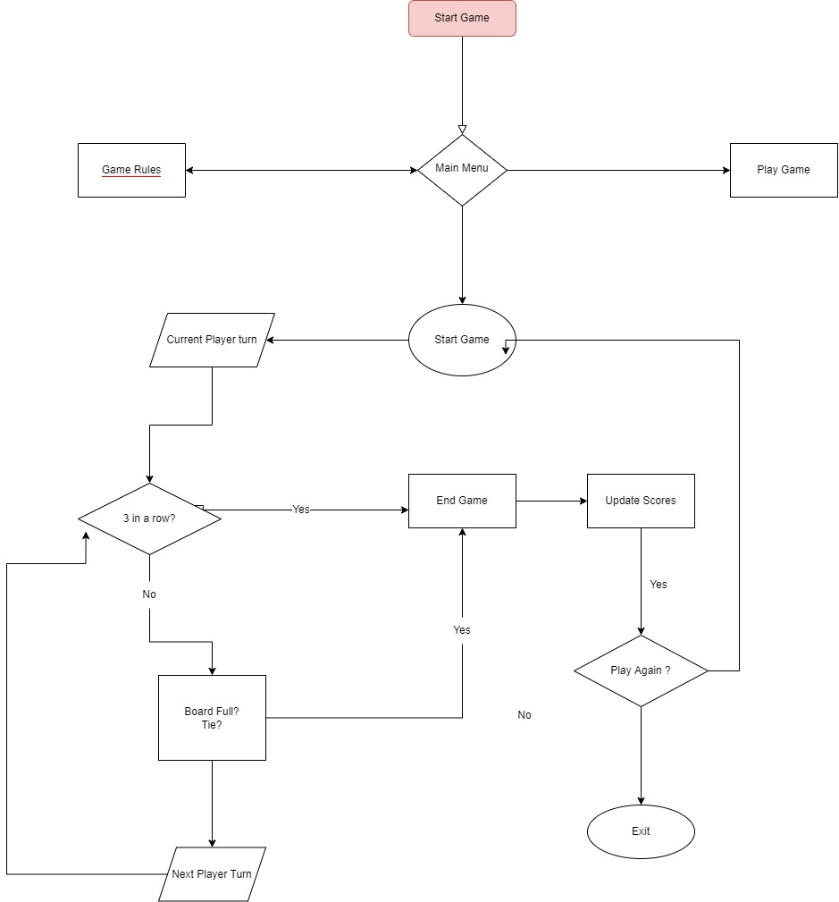

# Tic Tac Toe Game
- Tic Tac Toe is a python terminal game made for two players.
- The rule of the game is very simple
1. 1 player is "X" and the other is "O".
2. The game is played on a 3 by 3 board.
3. Whichever player fills a row, column or diagnol by 3 in a row wins
#

## Project Goals

### User Goals
- Play a basic game of tic tac toe with a friend
- See the scores of who won.
- Be able to play multiple times
- Know the rules of the game

### Site Owner Goals
- A simple game of tic tac toe that is easy to understand
- Want the user to know how to play the game
- Expect users to play game again

### Target Audience
- Most preferably for 4+ as it requires some logical decisions
#

## Stories

### User Stories
- I want to be able to know the rules of the game
- I want to the site to be readable and simple
- I want to be able to play without errors.
- I want to know the scores of who won.
- I want to be able to play again.

### Site Owner Stories
- I want users to enjoy the game
- I want users to have an easy experience
- I want users to know what they have to input.
- I want users to be notified if they made an invalid input

#

## Technical Design
### Flowchart
- A structure of the game

Flowchart

## Technologies Used

### Languages

- Python

### Frameworks & Tools

- [Diagrams.net](https://app.diagrams.net/) was used to draw program flowchart
- [GitHub](https://github.com/) was used as a remote repository to store project code
- [Heroku Platform](https://dashboard.heroku.com/) was used to deploy the project into live environment
- [PEP8](http://pep8online.com/) was used to check my code against Python conventions
- [Visual Studio Code (VSCode)](https://code.visualstudio.com/) Was used as draft for gitpod.

### Libraries
- time - time.sleep() was used to delay print messages
- colorama - Used to color the text in terminal

#
## Features
